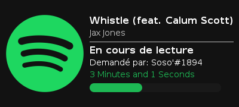

# 🛠 Mises à jour

## 10.2

📅 Publié le 18.07.2023



* **Nouvelle documentation**: disponible sur [https://docs.somusic.xyz](http://127.0.0.1:5000/o/PFVqkKtrsGAjO3WnXNkE/s/aCRTusWahhf9Io0mSjPk/). Cette documentation devrait aider les utilisateurs à mieux comprendre comment utiliser et interagir avec So' Music. -**Système de playlist**: en version bêta, qui sera disponible pour tous d'ici la fin de la semaine. Ce système permettra aux utilisateurs de créer et de gérer leurs propres listes de lecture pour une expérience musicale plus personnalisée.
* **Auto-complétion** lors de la recherche de musiques avec la commande `/play`. Cela facilitera et accélérera la recherche et la lecture des morceaux souhaités.
* Ajout de la **radio "Tomorrowland - One World Radio"**, offrant aux utilisateurs une plus large sélection musicale au sein de So' Music.
* Ajout de la **langue italienne** pour rendre la plateforme plus accessible aux utilisateurs italophones.



* Le statut de **So' Music - Manager** ainsi que **So' Music Bêta** a été ajouté sur le site.
* Création d'une organisation sur GitHub dédiée à So' Music, disponible à l'adresse [https://github.com/So-Music](https://github.com/So-Music)



* Les nouveaux membres rejoignant le serveur Discord de support recevront automatiquement un message de bienvenue et se verront attribuer les rôles appropriés.



* Migration du nom de domaine de l'ancien "sorway.fr" vers "somusic.xyz".



### <mark style="color:red;">Premium</mark>

Nous sommes ravis de vous annoncer l'ajout de fonctionnalités premium à So' Music pour améliorer votre expérience musicale ! Nous tenons à vous assurer que l'entièreté du bot restera gratuit et accessible à tous. Les fonctionnalités premium sont une façon de soutenir le développement continu de So' Music et de nous aider à offrir des services de qualité.

Pour obtenir le rang premium, il vous suffira de soutenir le bot en votant sur les différents sites où il est référencé. Un simple vote sur l'un de ces sites sera pris en compte, et vous recevrez le rang premium pour une durée de 12 heures. Il y aura un délai (cooldown) entre chaque vote pour garantir une utilisation équitable.

Nous tenons à remercier chaleureusement tous ceux qui ont soutenu le projet depuis ses débuts. En reconnaissance de votre engagement, vous bénéficierez du rang premium à vie, sans besoin de voter.

Les fonctionnalités premium seront disponibles très prochainement, et nous vous tiendrons informés dès qu'elles seront opérationnelles. Vos votes et votre soutien sont essentiels pour faire de So' Music une plateforme musicale exceptionnelle.

Nous vous remercions sincèrement pour votre fidélité et votre participation active dans l'évolution de So' Music. Restez à l'écoute pour plus d'annonces passionnantes à venir !

## 10.1

📅 Publié le 11.07.2023



* Commande `/bass-boost`: Vous pouvez désormais utiliser la commande pour augmenter les basses de vos morceaux préférés et profiter d'un son encore plus puissant.
* Commande `/user`: En effet, elle vous permet d'afficher les informations sur un utilisateur spécifique. Vous pouvez utiliser cette commande pour obtenir des détails tels que le nom d'utilisateur, le grade, etc.
* **Système de compte utilisateur**: Nous avons mis en place un système de compte utilisateur en prévision d'une future mise à jour qui inclura un système de playlist intégré au bot. Restez à l'écoute pour plus de détails à ce sujet !
* Affichage de l'image des musiques **Spotify**: Désormais, lorsque vous utilisez la commande `/nowplaying` pour afficher les informations sur une musique provenant de Spotify, l'image de la musique sera également affichée, ajoutant ainsi une dimension visuelle à votre expérience d'écoute.



Nous avons également effectué une mise à jour de notre politique de confidentialité. Vous pouvez consulter la nouvelle politique de confidentialité à l'adresse suivante: [https://somusic.sorway.fr/privacy](https://somusic.sorway.fr/privacy). Nous attachons une grande importance à la protection de vos données personnelles et nous vous encourageons à prendre connaissance de ces changements



## 10.0

📅 Publié le 19.05.2023



* Ajout de la commande `/clearqueue`
* Ajout de la commande `/seek`



* Mise à jour de l'interface



## 9.1

📅 Publié le 18.03.2023



Mise à jour de la commande `/now-playing`

<figure><figcaption></figcaption></figure>



* Mise à jour de la page d'accueil



## 9.0

📅 Publié le 10.03.2023



* Ajout de la commande `/botinfo`
* Ajout de la commande `/shuffle`
* Ajout de la source **SoundCloud**
* Ajout de la source **Twitch**

Nous avons redéveloppé le bot à partir de 0, notamment pour l'optimiser. Il est désormais plus fluide, de nombreux bugs ont été corrigés.



* Correction d'un bug lors de l'actualisation de l'état


